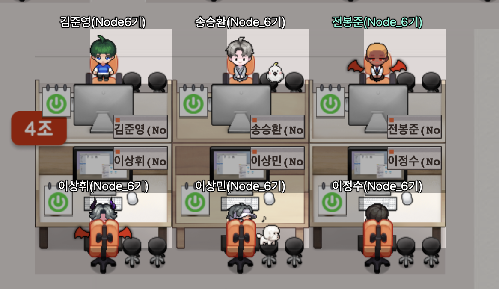
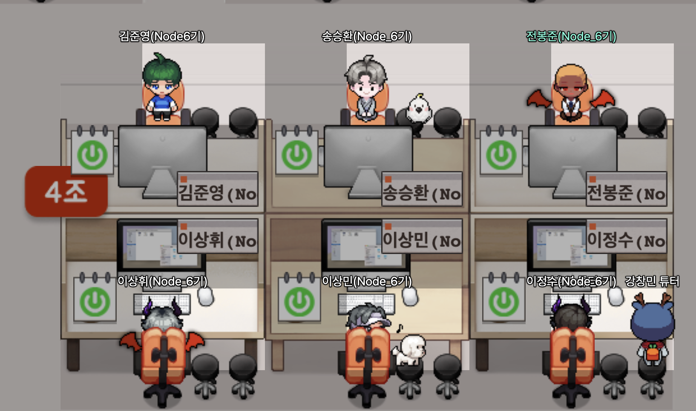
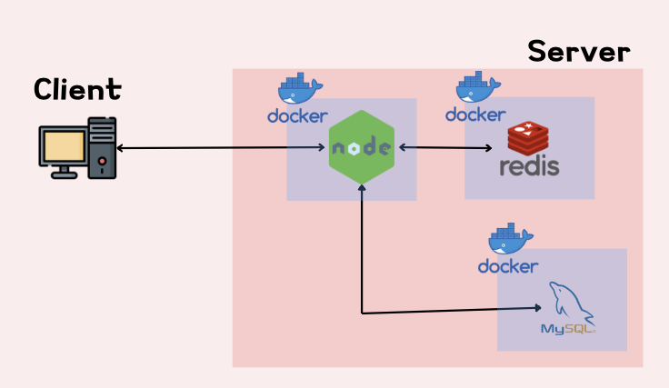
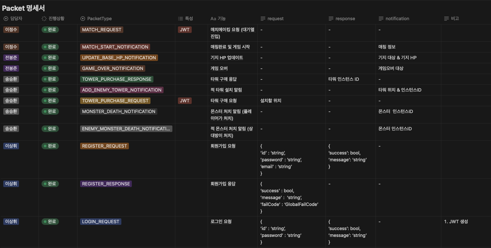
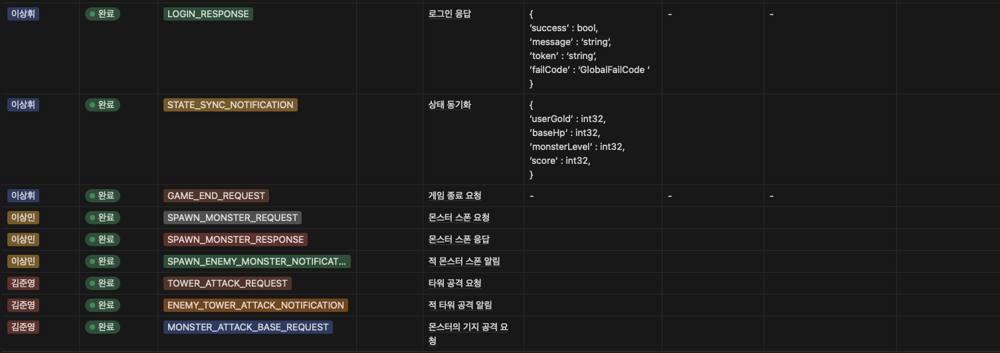
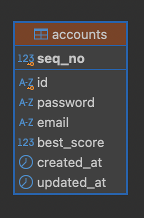

# [ Chapter5 Team Projects ] 4 Dollar Defense

## Team 4 dollars 💵




## 팀원 소개

|                                                 김준영                                                 |                                                송승환                                                 |                                                전봉준                                                 |
| :----------------------------------------------------------------------------------------------------: | :---------------------------------------------------------------------------------------------------: | :---------------------------------------------------------------------------------------------------: |
|                                                  ISTP                                                  |                                                 INTP                                                  |                                                 INTP                                                  |
| <p></p> | <p></p> | <p></p> |
|                                [@WaDDaDDa](https://github.com/WaDDaDDa)                                |                           [@ShrimpManiac](https://github.com/ShrimpManiac)                            |                              [@devbong92](https://github.com/devbong92)                               |
|                                [Blog Link](https://waddak.tistory.com)                                 |                               [Blog Link](https://velog.io/@lirymambo)                                |                              [Blog Link](https://velog.io/@vamuzz/posts)                              |

|                                                이상휘                                                 |                                                 이상민                                                 |                                                이정수                                                 |
| :---------------------------------------------------------------------------------------------------: | :----------------------------------------------------------------------------------------------------: | :---------------------------------------------------------------------------------------------------: |
|                                                 ISFJ                                                  |                                                  ISFJ                                                  |                                                 INTP                                                  |
| <p></p> | <p></p> | <p></p> |
|                            [@LeeSangHwee](https://github.com/LeeSangHwee)                             |                                  [@yism97](https://github.com/yism97)                                  |                                [@artbiit](https://github.com/artbiit)                                 |
|                                [Blog Link](https://velog.io/@tkdgnl56)                                |                                 [Blog Link](https://velog.io/@lsm1997)                                 |                                [Blog Link](https://velog.io/@artbiit)                                 |

## 시연영상

[](https://youtu.be/Zs2deBwlfOc)

## 프로젝트 개요

**4-Deffense**는 TCP 통신으로 구현한 1:1 멀티플레이어 타워디펜스 게임입니다. 플레이어는 타워를 설치하여 몰려드는 몬스터들로부터 기지를 방어하고 상대방보다 더 오래 살아남아야 합니다.

## 구현 기능

### 필수 기능

- [x] **회원가입/로그인** - JWT 기반
- [x] **게임 매칭**
- [x] **상태 동기화**
- [x] **몬스터 소환**
- [x] **타워설치**
- [x] **타워 -> 몬스터 공격**
- [x] **몬스터 사망처리** - 플레이어 골드/점수 증가
- [x] **기지 피격**
- [x] **게임오버**
- [x] **게임 진행에 따른 난이도 (몬스터 레벨) 증가**

### 추가 기능

- [x] **커스텀 몬스터 이동경로**
- [x] **유저정보 캐싱** - Redis

### 서버 구성



### 프로젝트 구조

```
📁 ROOT
├── Dockerfile
├── LICENSE
├── README.md
├── 📁 assets
│   ├── base.json
│   ├── monster.json
│   └── tower.json
├── docker-compose.yml
├── 📁 docs
│   └── troubleshootings
│       ├── missingFieldsTowerId.md
│       ├── monsterAscension.md
│       ├── monsterAscension.png
│       ├── monsterCollision.md
│       ├── monsterCollision.png
│       └── opponentUser.md
├── eslint.config.js
├── jsonconfig.json
├── package.json
├── 📁 src
│   ├── 📁 classes
│   │   ├── 📁 managers
│   │   │   ├── base.manager.js
│   │   │   └── interval.manager.js
│   │   └── 📁 models
│   │       ├── game.class.js
│   │       ├── matchMaker.class.js
│   │       ├── monster.class.js
│   │       ├── tower.class.js
│   │       └── user.class.js
│   ├── 📁 configs
│   │   └── configs.js
│   ├── 📁 constants
│   │   ├── assets.js
│   │   ├── constants.js
│   │   ├── env.js
│   │   ├── game.js
│   │   ├── handlerIds.js
│   │   ├── header.js
│   │   └── redis.js
│   ├── 📁 db
│   │   ├── 📁 game
│   │   │   └── game.redis.js
│   │   ├── 📁 match
│   │   │   └── match.redis.js
│   │   ├── mysql.js
│   │   ├── redis.js
│   │   ├── 📁 sql
│   │   │   └── schema.sql
│   │   ├── 📁 user
│   │   │   ├── user.coord.db.js
│   │   │   ├── user.coord.queris.js
│   │   │   ├── user.db.js
│   │   │   └── user.queries.js
│   │   └── utils.js
│   ├── 📁 events
│   │   ├── onConnection.js
│   │   ├── onData.js
│   │   ├── onEnd.js
│   │   └── onError.js
│   ├── 📁 handlers
│   │   ├── 📁 attack
│   │   │   └── attack.handler.js
│   │   ├── 📁 game
│   │   ├── index.js
│   │   ├── login.handler.js
│   │   ├── matchRequest.handler.js
│   │   ├── 📁 monster
│   │   │   ├── monsterDeath.handler.js
│   │   │   └── monsterSpawn.handler.js
│   │   ├── register.handler.js
│   │   ├── result.js
│   │   ├── 📁 tower
│   │   │   └── towerPurchase.handler.js
│   │   └── user
│   ├── 📁 init
│   │   ├── index.js
│   │   ├── loadAssets.js
│   │   └── loadProtos.js
│   ├── 📁 protobuf
│   │   └── packet.proto
│   ├── 📁 server.js
│   ├── 📁 session
│   │   ├── game.session.js
│   │   ├── sessions.js
│   │   └── user.session.js
│   ├── 📁 tests
│   │   ├── attack.test.js
│   │   ├── client.test.js
│   │   └── register.test.js
│   └── 📁 utils
│       ├── 📁 asset
│       │   └── getAssets.js
│       ├── dateFormatter.js
│       ├── 📁 error
│       │   ├── customError.js
│       │   ├── errorCodes.js
│       │   └── errorHandler.js
│       ├── logger.js
│       ├── 📁 notification
│       │   ├── attack.notification.js
│       │   ├── base.notification.js
│       │   ├── makeNotification.js
│       │   ├── match.notification.js
│       │   ├── monster.notification.js
│       │   ├── stateSync.notification.js
│       │   └── tower.notification.js
│       ├── 📁 parser
│       │   └── packetParser.js
│       ├── 📁 response
│       │   └── createResponse.js
│       └── transformCase.js
└── yarn.lock
```

## 트러블 슈팅

- [C2S전투알림 패킷에 타워ID가 누락되던 오류 해결](./docs/troubleshootings/missingFieldsTowerId.md)
- [적 타워설치 알림을 보낼때 상대방 유저 객체에 접근하지 못하는 오류 수정
  ](./docs//troubleshootings/opponentUser.md)
- [몬스터가 길을 따라서 이동하지 않고 시작하자마자 위 또는 아래로 일직선으로 이동하다가 맵을 이탈하는 오류 해결](./docs/troubleshootings/monsterAscension.md)
- [경로를 정상적으로 줘도 몬스터가 이상하게 움직이는 현상 해결](./docs/troubleshootings/monsterCollision.md)

### 패킷 명세서




### ERD

#### User Data - MySQL



### Game Data - JSON

```json
// base.json
{
  "name": "base",
  "version": "1.0.0",
  "data": [
    {
      "maxHp": 100
    }
  ]
}
```

```json
// monster.json
{
  "name": "monster",
  "version": "1.0.0",
  "data": [
    {
      "id": "MON00001",
      "DisplayName": "외눈공룡",
      "Description": "약한공룡",
      "maxHp": 100,
      "HpPerLv": 10,
      "spd": 150,
      "def": 0,
      "DefPerLv": 3,
      "Atk": 10,
      "AtkPerLv": 2
    },
    {
      "id": "MON00002",
      "DisplayName": "흰눈애벌레",
      "Description": "약한벌레",
      "maxHp": 100,
      "HpPerLv": 15,
      "spd": 150,
      "def": 0,
      "DefPerLv": 5,
      "Atk": 5,
      "AtkPerLv": 1
    },
    {
      "id": "MON00003",
      "DisplayName": "뾰족부리공룡",
      "Description": "빠른공룡",
      "maxHp": 100,
      "HpPerLv": 10,
      "spd": 150,
      "def": 0,
      "DefPerLv": 1,
      "Atk": 7,
      "AtkPerLv": 2
    },
    {
      "id": "MON00004",
      "DisplayName": "붉은눈공룡",
      "Description": "신기한공룡",
      "maxHp": 100,
      "HpPerLv": 20,
      "spd": 150,
      "def": 0,
      "DefPerLv": 10,
      "Atk": 15,
      "AtkPerLv": 3
    },
    {
      "id": "MON00005",
      "DisplayName": "검정박쥐",
      "Description": "제일 빠름",
      "maxHp": 100,
      "HpPerLv": 10,
      "spd": 150,
      "def": 0,
      "DefPerLv": 1,
      "Atk": 10,
      "AtkPerLv": 3
    }
  ]
}
```

```json
{
  "name": "tower",
  "version": "1.0.0",
  "data": [
    {
      "id": "TOW00001",
      "DisplayName": "일반타워",
      "Description": "평범한 타워",
      "Power": 40,
      "PowerPerLv": 10,
      "Range": 300,
      "Cooldown": 180,
      "Duration": 30,
      "Cost": 100,
      "Extra": 1,
      "ExtraPerLv": 0.5
    },
    {
      "id": "TOW00002",
      "DisplayName": "화염타워",
      "Description": "화염 광역공격 타워",
      "Power": 60,
      "PowerPerLv": 15,
      "Range": 400,
      "Cooldown": 300,
      "Duration": 0,
      "Cost": 100,
      "Extra": 100,
      "ExtraPerLv": 0
    },
    {
      "id": "TOW00003",
      "DisplayName": "번개타워",
      "Description": "체인 라이트닝 타워",
      "Power": 20,
      "PowerPerLv": 5,
      "Range": 200,
      "Cooldown": 60,
      "Duration": 0,
      "Cost": 100,
      "Extra": 3,
      "ExtraPerLv": 1
    },
    {
      "id": "TOW00004",
      "DisplayName": "얼음타워",
      "Description": "이동속도를 줄여주는 타워",
      "Power": 10,
      "PowerPerLv": 5,
      "Range": 300,
      "Cooldown": 120,
      "Duration": 0,
      "Cost": 100,
      "Extra": 10,
      "ExtraPerLv": 1
    }
  ]
}
```
